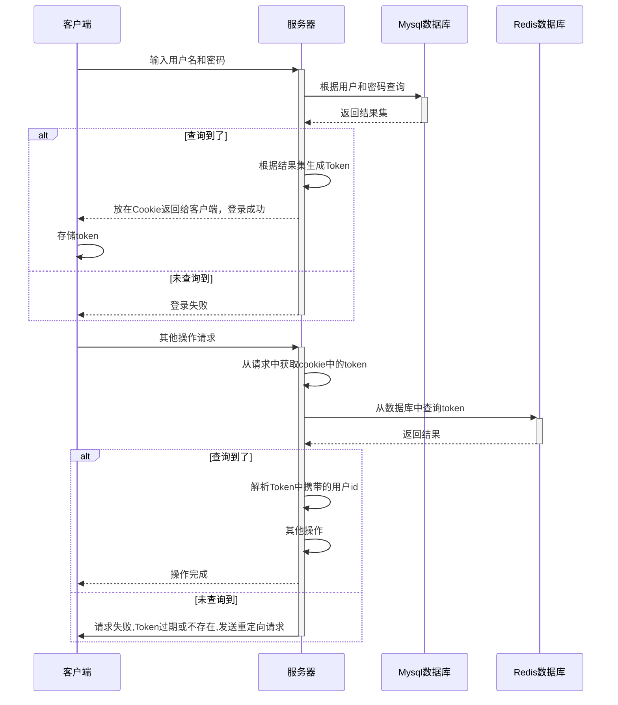
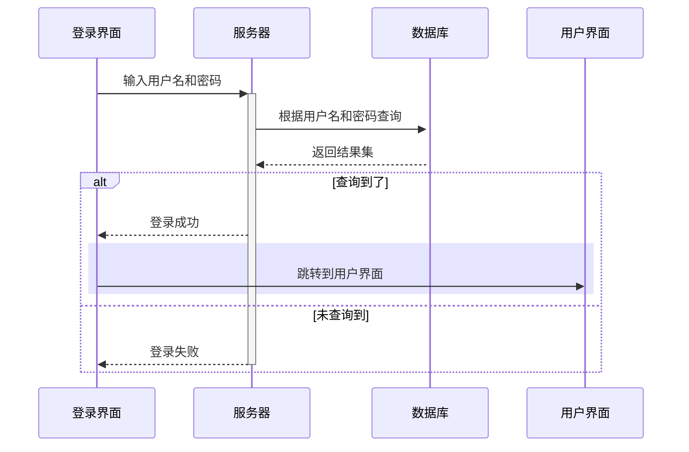
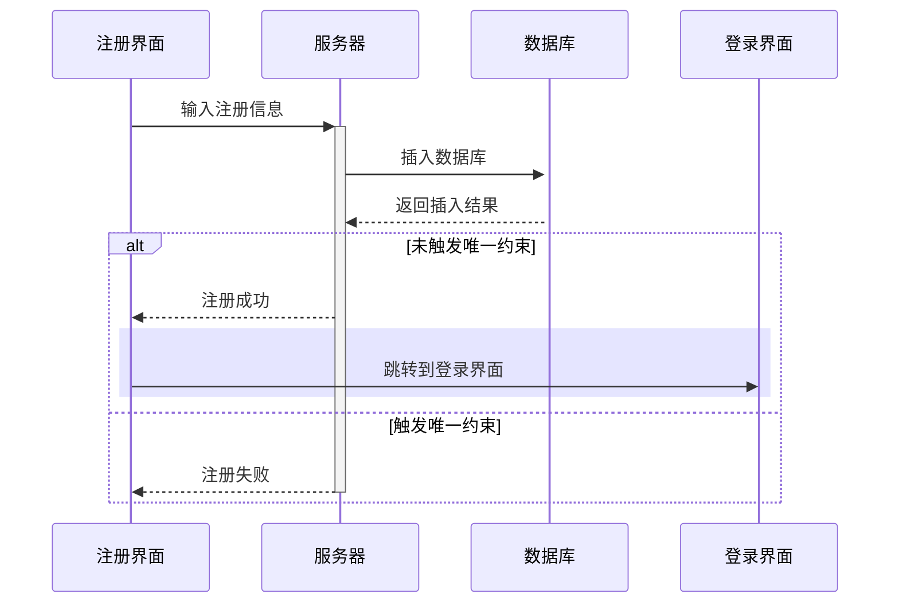
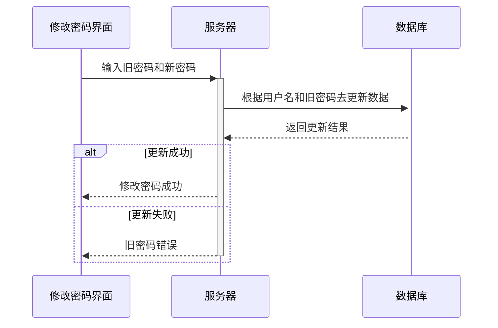

# 基于JavaEE的二手交易平台

By hnitACM

## 1.修订记录

|   日期    | 说明 |
| :-------: | :--: |
| 2020.5.10 | 初稿 |
|           |      |
|           |      |

## 2.需求分析

### 2.1 用户模块

#### 2.1.1 登录注册

- 登录
- 注册

#### 2.1.2 修改个人信息

- 修改密码
- 修改相关个人信息(邮件，电话，头像等等)

#### 2.1.3 商品模块(出售)

- 上下架商品
- 修改商品相关信息

#### 2.1.4 浏览商品

- 首页中会推送数据库中存在的商品(轮播图等)
- 通过三级分类菜单查看商品
- 通过搜索查看商品
- 查看某件商品的相关信息
- 收藏商品
- 对手机浏览进行适配

#### 2.1.5 购买商品

- 购买之前可以与卖家通过站内消息沟通
- 购买后进入支付页面(仅支持支付宝)
- 选择商品交易方式(当面交易，快递)
- 确认收货

#### 2.1.6 评价模块

- 对交易过的卖家进行评价
- 查看他人对自己的评价


### 2.2 管理员模块

#### 2.2.1 登陆注册

- 登录
- 注册
- 修改管理员密码

#### 2.2.2 商品管理

- 对所有商品进行上下架操作
- 修改某件商品的相关信息
- 修改商品分类的信息

#### 2.2.3 用户管理

- 修改用户信息
- 用户的增删改查(删除为逻辑删除)、
- 最好有用户和商品的可视化分析


## 3. 功能详细设计

### 3.1. 协议规范

#### 3.1.1. 前后端通信规范

Json格式：

```json
{
	msg:"",//携带消息
	data:"",//携带数据
	status:"", //此次请求自定义码
}
```

#### 3.1.2. 鉴权机制



### 3.2. 用户模块

#### 3.2.1. 登录



#### 3.2.2. 注册



#### 3.2.3. 修改密码



## 4. 数据库设计


## 5. 接口说明

### 5.1. 用户接口

#### 5.1.1. 登录接口

- 路径：/user/login
- 方法：POST
- 参数：
  - username：用户名
  - password：密码
- 返回：
  - uiid：用户编号

#### 5.1.2. 注册接口

- 路径：/user/register
- 方法：POST
- 参数：
  - username：用户名
  - password：密码
  - phonenum：手机号码

#### 5.1.3. 获取个人资料

- 路径：/user/getmyprofile
- 方法：GET
- 参数：token验证
- 返回：
