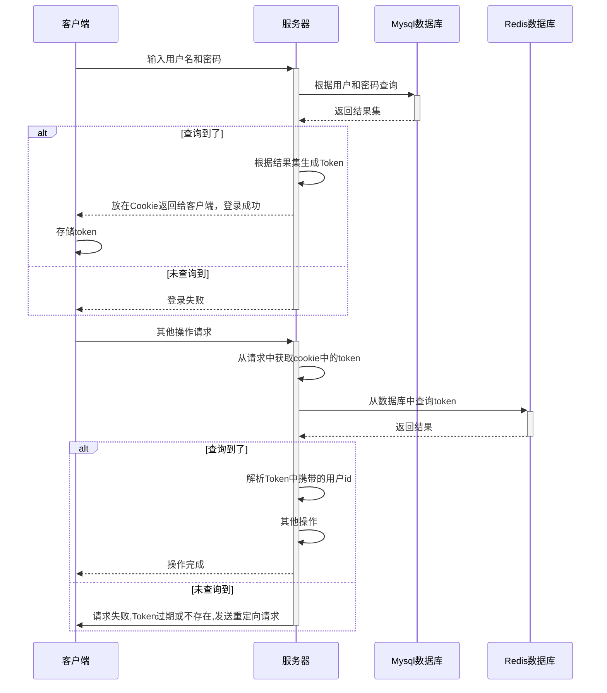
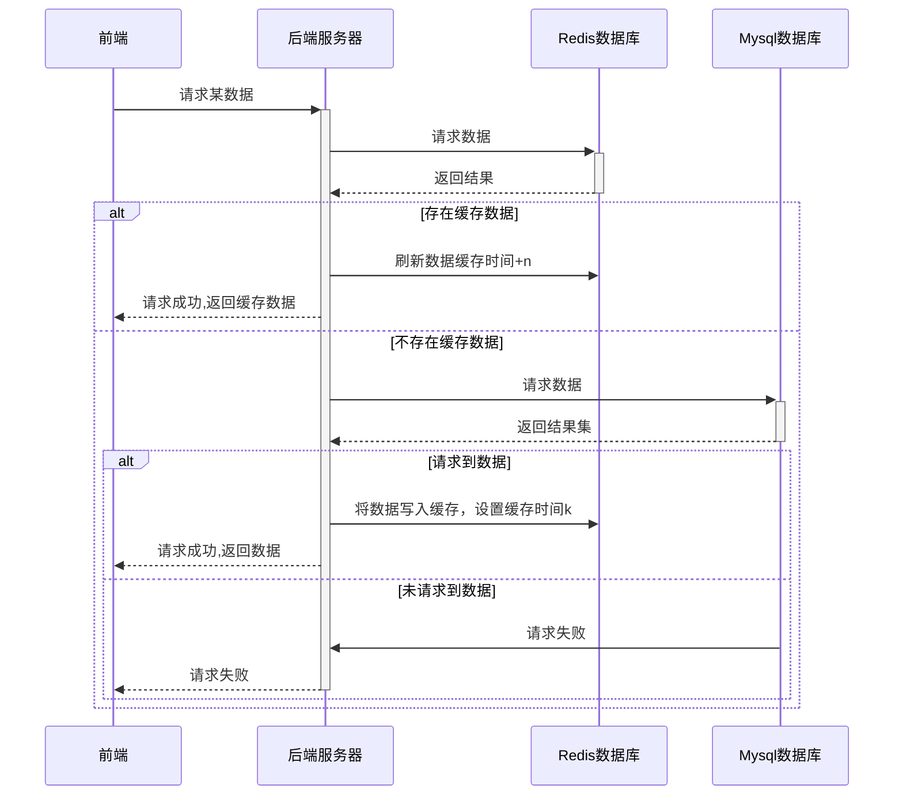
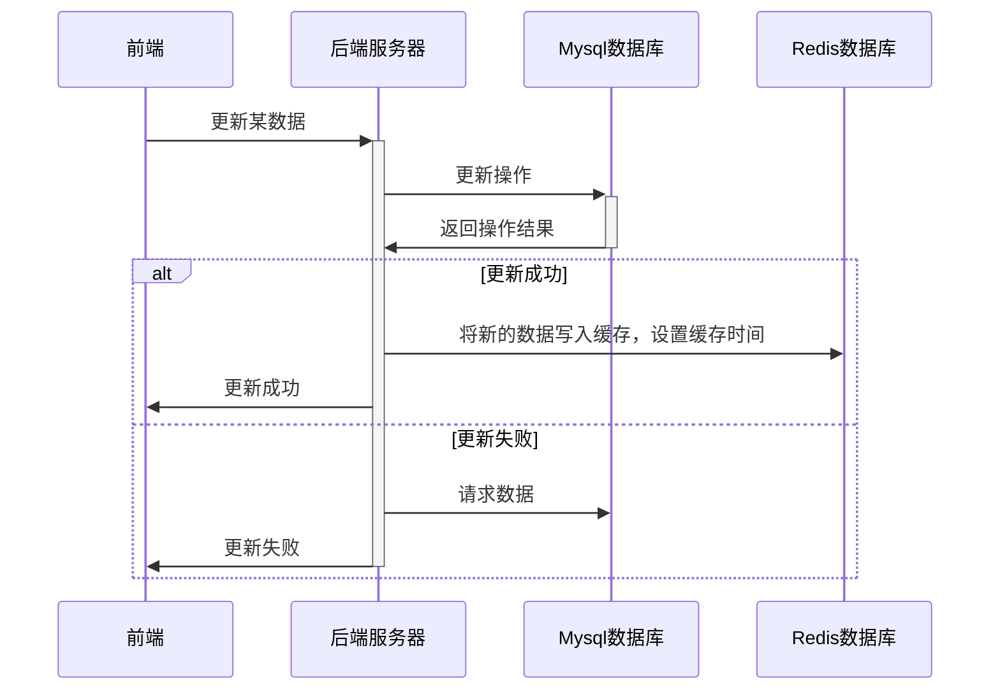
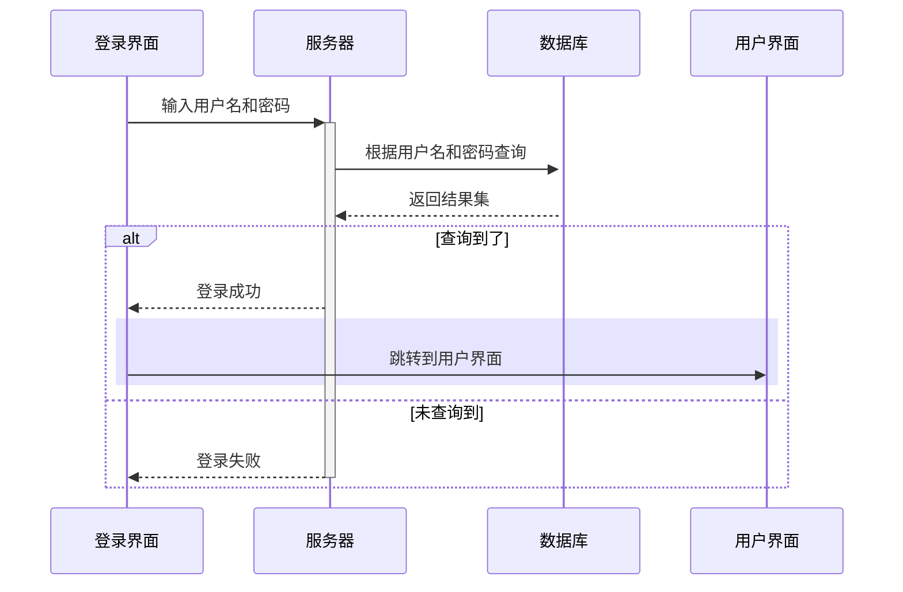
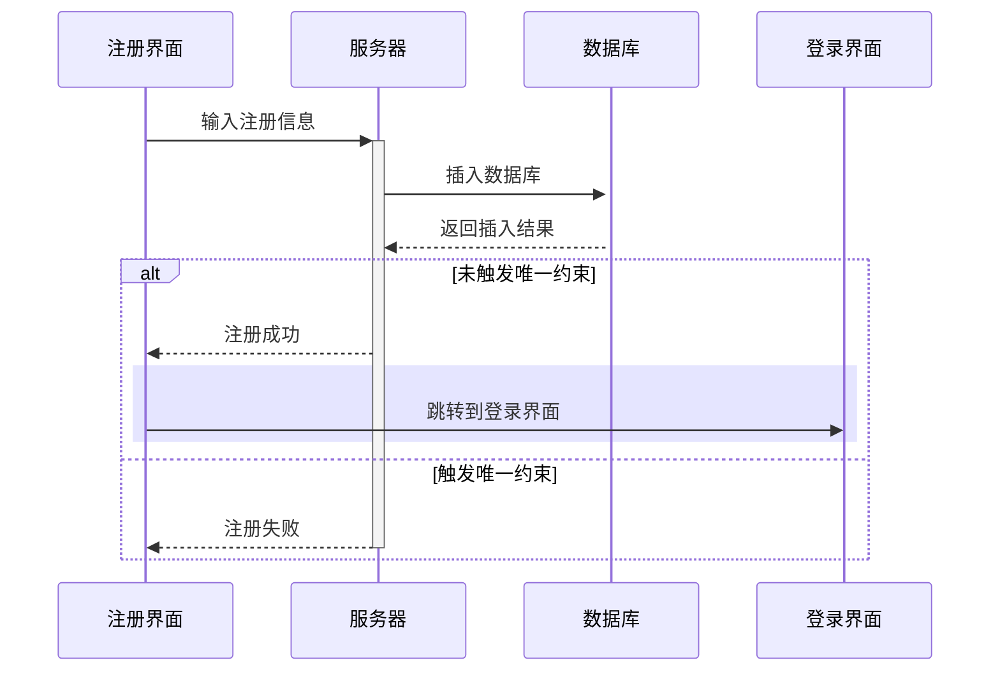
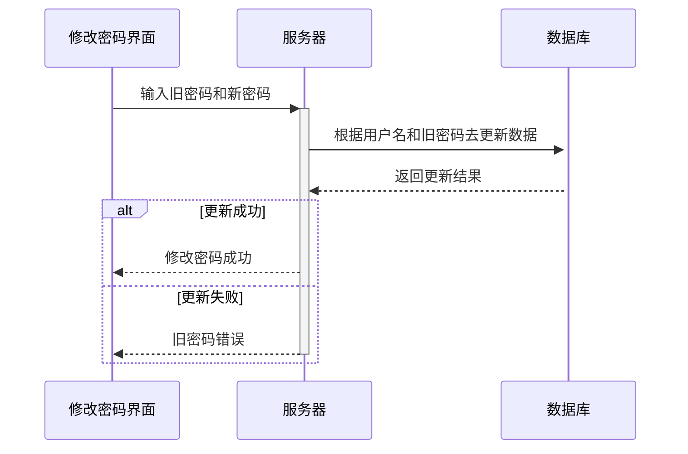

# 基于JavaEE的二手交易平台

By hnitACM

## 1. 修订记录

|   日期    | 说明 |
| :-------: | :--: |
| 2020.5.10 | 初稿 |
| 2020.5.17|  添加缓存机制 |
|2020.5.20| 完善数据表设计|
## 2. 需求分析

### 2.1. 用户模块

#### 2.1.1. 登录注册

- 登录
- 注册

#### 2.1.2. 修改个人信息

- 修改密码
- 修改相关个人信息(邮件，电话，头像等等)

#### 2.1.3. 商品模块（卖家）

- 上下架商品
- 修改商品相关信息

#### 2.1.4. 浏览商品

- 首页中会推送数据库中存在的商品(轮播图等)
- 通过三级分类菜单查看商品
- 通过搜索查看商品
- 查看某件商品的相关信息
- 收藏商品
- 对手机浏览进行适配

#### 2.1.5. 购买商品

- 购买之前可以与卖家通过站内消息沟通
- 购买后进入支付页面(仅支持支付宝)
- 选择商品交易方式(当面交易，快递)
- 确认收货

#### 2.1.6. 评价模块

- 对交易过的卖家进行评价
- 查看他人对自己的评价


### 2.2. 管理员模块

#### 2.2.1. 登陆注册

- 登录
- 修改管理员密码

#### 2.2.2. 商品管理

- 对所有商品进行上下架操作
- 修改某件商品的相关信息
- 修改商品分类的信息

#### 2.2.3 用户管理

- 修改用户信息
- 用户的增删改查(删除为逻辑删除)、
- 最好有用户和商品的可视化分析

### 2.3. 支付功能

- 支付宝

### 2.4. 用户角色认定

#### 2.4.1. 卖家

- 调用支付宝接口获取实名信息

#### 2.4.2. 管理员

- 由上层管理员给与权限


## 3. 功能详细设计

### 3.2. 运行环境

1. 后端开发框架：SpringBoot
2. 数据库：Mysql5.7.29
3. 前端开发框架：Vue+ElementUI
4. 缓存数据库：Redis

### 3.1. 协议规范

#### 3.1.1. 前后端通信规范

Json格式：

```json
{
	msg:"",//携带消息
	data:"",//携带数据
	code:"", //此次请求自定义码
}
```

#### 3.1.2. 鉴权机制



#### 3.1.3. 缓存机制
1. 读取缓存机制


2. 更新缓存机制 




### 3.2. 用户模块

#### 3.2.1. 登录



#### 3.2.2. 注册



#### 3.2.3. 修改密码



## 4. 数据库设计

### 4.1. 数据库架构

#### 4.1.1. 运行环境


### 4.2. 数据表

外键关系由程序实现 uuid，MD5密文加密 以及约束都由程序实现。

#### 4.2.1. 用户信息表
表名：user_info

| 字段名 | 类型 | 大小 | 备注 |
| ------ | :--- | :--- | :--- |
|   user_id   |   bigint   |      | 主键，自增   |
| user_name | varchar | 20 | 用户名，唯一，非空 |
|user_password |varchar| 16 | 密码 非空 md5加密（程序实现）|
|user_telephone |varchar| 11 |手机号码 非空|
|user_status|int| 1 |登陆状态 0为未登录 1为已登录 默认0 0~2（程序实现约束）|
|user_email|varchar| 40 |邮箱号码 默认空|
|user_type|int| 1 |用户类型 0为买家 1为商家 2既是卖家又是商家 默认0|
|created|TIMESTAMP| |创建时间,默认当前时间|
|modified|TIMESTAMP| |更新时间,默认当前时间|
|seller_id|bigint| |可空,默认空，外键（seller_info.seller_id）|

#### 4.2.2. 卖家信息表

seller_info

| 字段名               | 类型      | 大小 | 备注                  |
| -------------------- | --------- | ---- | --------------------- |
| seller_id            | bigint    |      | 主键 自增         |
| seller_certification | varchar   |   30   |  卖家身份认证 非空  |
| seller_evaluation_number  | bigint   |      |  评论数量 默认0    |
| seller_order_number | bigint | |订单数量 默认0|
| seller_score         | float     |      | 买家平均评分，默认 0 分数为1~5分（程序实现约束） |
| created              | timestamp |      | 创建时间,默认当前时间 |
| modifide             | timestamp |      | 更新时间,默认当前时间 |

#### 4.2.2. 商品信息表

表名： good_info

| 字段名 | 类型 | 大小 | 备注 |
| :----: | ---- | ---- | ---- |
|good_id |bigint| |主键 自增|
|good_number |int||商品编号 唯一 非空 默认uuid_short|
|good_name|varchar|100|商品名 默认空|
|good_price|float||商品价格 默认0|
|seller_id|bigint| |商家 非空 默认0 外键（user_info.user_id）|
|type_id|bigint| |商品类型 默认0 外键（type_info.type_id）|
|good_image|varchar|100|商品图地址 默认空|
|good_describe|text| |商品描述|
|created|TIMESTAMP||创建时间,默认当前时间|
|modified|TIMESTAMP||更新时间,默认当前时间|

#### 4.2.3. 订单记录表

表名：order_info

| 字段名 | 类型 | 大小 | 备注 |
| :----: | ---- | ---- | ---- |
|order_id|bigint||主键 自增|
|order_number|int||订单编号 默认 uuid_short|
|order_price|float||订单金额 默认0|
|good_id|bigint| |商品号 默认0 外键（good_info.good_id）|
|user_id|bigint| |买家 默认0 外键（user_info.user_id）|
|seller_id|bigint| |商家 默认0 外键（user_info.user_id）|
|order_status|int|1 |0为未付款 1为已付款 2为配送中 3为已完成 默认0 |
|address_id|bigint| |收货地址 默认空 外键（address_info.address_id）|
|created|TIMESTAMP| |创建时间,默认当前时间|
|modified|TIMESTAMP||更新时间,默认当前时间|

#### 4.2.4. 评价记录表

表名：evaluation_info

| 字段名 | 类型 | 大小 | 备注 |
| :----: | ---- | ---- | ---- |
|evaluation_id|bigint||主键 自增|
|user_id|bigint||评论人 默认0 外键（user_info.user_id）|
|score|float||打分 默认0 分数为0~5分|
|created|TIMESTAMP||创建时间,默认当前时间|
|modified|TIMESTAMP||更新时间,默认当前时间|

#### 4.2.5. 会话记录表

表名：talk_info

| 字段名 | 类型 | 大小 | 备注 |
| :----: | ---- | ---- | ---- |
|talk_id|bigint||主键，自增|
|seller_id|Bigint||卖家，外键（user_info.user_id），默认0|
|user_id|Bigint||买家，外键（user_info.user_id） 默认0|
|talk_content|varchar|256|聊天内容 默认空|
|talk_status|int|1|0为未读 1为已读 默认0|
|created|TIMESTAMP||创建时间,默认当前时间|
|modified|TIMESTAMP||更新时间,默认当前时间|

#### 4.2.6. 商品类型表

表名：good_type

| 字段名 | 类型 | 大小 | 备注 |
| :----: | ---- | ---- | ---- |
|type_id|bigint||自增 主键|
|type_name|varchar|20|类型名称 默认空|
|type_parent_id|bigint||商品父类 默认0|
|created|TIMESTAMP||创建时间,默认当前时间|
|modified|TIMESTAMP||更新时间,默认当前时间|

#### 4.2.7. 地址信息表

表名：address_info

| 字段名 | 类型 | 大小 | 备注 |
| :----: | ---- | ---- | ---- |
|address_id|bigint||主键 自增|
|user_id|bigint||外键（user_info.user_id）,地址所属用户,默认0|
|address|varchar|120|地址|
|created|Timestamp||创建时间,默认当前时间|
|modified|Timestamp||更新时间,默认当前时间|


## 5. 接口说明

### 5.1. 用户接口

#### 5.1.1. 登录接口

- 路径：/user/login
- 方法：POST
- 参数：
  - username：用户名
  - password：密码
- 返回：
  - uiid：用户编号

#### 5.1.2. 注册接口

- 路径：/user/register
- 方法：POST
- 参数：
  - username：用户名
  - password：密码
  - phonenum：手机号码

#### 5.1.3. 获取个人资料

- 路径：/user/getmyprofile
- 方法：GET
- 参数：token验证
- 返回：


## 附录
1. 数据库建表脚本

```sql
# 创建数据库
drop database flea_market;
create database if not exists flea_market;
# 选择数据库
use flea_market;

# 用户信息表
# select * from user_info;
# drop  table user_info;
create table user_info
(
    user_id        bigint primary key auto_increment comment '用户id',
    user_name      varchar(20) unique not null default '' comment '用户名',
    use_password   varchar(16)        not null default '' comment '密码',
    user_telephone varchar(11) unique not null default '' comment '手机号',
    user_status    int                not null default 0 comment '登录状态',
    user_email     varchar(40)                 default '' comment '邮箱',
    user_type      int                not null default 0 comment '用户类型',
    created        timestamp                   default current_timestamp,
    modified       timestamp                   default current_timestamp,
    seller_id      bigint unique               default 0 comment '卖家id 外键关系(seller_info.seller_id)'
) engine = innodb
  charset = utf8
  auto_increment = 1;

#卖家信息表
create table seller_info
(
    seller_id                bigint primary key auto_increment,
    seller_certification     varchar(20) not null default '' comment '商家认证信息',
    seller_evaluation_number bigint      not null default 0 comment '商家的评论数量',
    seller_order_number      bigint      not null default 0 comment '商家的订单数量',
    seller_score             float       not null default 0 comment '商家的评分',
    created                  timestamp   not null default current_timestamp,
    modified                 timestamp   not null default current_timestamp
) engine = innodb;

# 商品信息表
# drop table good_info;
create table good_info
(
    good_id       bigint primary key auto_increment,
    good_number   int unique   not null default 0 comment '商品编号',
    good_name     varchar(100) not null default '' comment '商品名',
    good_price    float        not null default 0 comment '商品价格',
    seller_id     bigint       not null default 0 comment '商家id',
    type_id       bigint       not null default 0 comment '类型id 外键关系(type_info.type_id)',
    good_image    varchar(100) not null default '' comment '商品图图床地址',
    good_describe text comment '商品描述',
    created       timestamp             default current_timestamp,
    modified      timestamp             default current_timestamp
) engine = innodb
  charset = utf8
  auto_increment = 1;

# 订单记录表
create table order_info
(
    order_id     bigint primary key auto_increment,
    order_number int unique not null default 0 comment '订单编号',
    order_price  float      not null default 0 comment '订单金额',
    good_id      bigint     not null default 0 comment '商品id 外键关系(good_info.good_id)',
    user_id      bigint     not null default 0 comment '用户id 外键关系(user_info.user_id)',
    seller_id    bigint     not null default 0 comment '卖家id 外键关系(seller_info.seller-id)',
    order_status int        not null default 0 comment '订单状态',
    address_id   bigint     not null default 0 comment '地址id 外键关系(address_info.address_id',
    created      timestamp  not null default current_timestamp,
    modified     timestamp  not null default current_timestamp
) engine = innodb
  charset = utf8
  auto_increment = 1;

# 评价记录表
create table evaluation_info
(
    evaluation_id bigint primary key auto_increment,
    user_id       bigint    not null default 0 comment '用户id 外键关系(user_info.user_id)',
    score         float     not null default 0 comment '评价分数',
    created       timestamp not null default current_timestamp,
    modified      timestamp not null default current_timestamp
) engine = innodb
  charset = utf8
  auto_increment = 1;

# 会话记录表
# drop table talk_info;
create table talk_info
(
    talk_id      bigint primary key,/**/
    seller_id    bigint       not null default 0 comment '卖家id 外键关系(seller_info.seller-id)',
    user_id      bigint       not null default 0 comment '用户id 外键关系(user_info.user_id)',
    talk_content varchar(256) not null default '' comment '聊天记录',
    talk_status  int          not null default 0 comment '信息状态',
    created      timestamp    not null default current_timestamp,
    modified     timestamp    not null default current_timestamp
) engine = innodb
  charset = utf8
  auto_increment = 1;

# 商品类型表
create table good_type
(
    type_id        bigint primary key auto_increment,
    type_name      varchar(20) not null default '' comment '类型名',
    type_parent_id bigint      not null default 0 comment '商品父类',
    created        timestamp   not null default current_timestamp,
    modified       timestamp   not null default current_timestamp
) engine = innodb
  charset = utf8
  auto_increment = 1;

# 地址信息表
create table address_info
(
    address_id bigint primary key auto_increment,
    user_id    bigint       not null default 0 comment '用户id 外键关系(user_info.user_id)',
    address    varchar(120) not null default '' comment '详细地址',
    created    timestamp    not null default current_timestamp,
    modified   timestamp    not null default current_timestamp
) engine = innodb
  charset = utf8
  auto_increment = 1;

```
